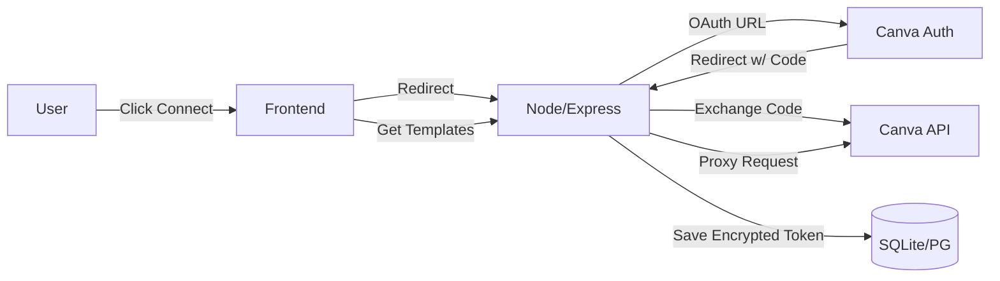

# ChatBharat x Canva Integration Guide

This guide details how to deploy the production-ready backend for the Canva Integration.

## 1. System Architecture



## 2. Setup & Deployment

### Step 1: Canva Developer Portal
1. Create an app in [Canva Developers](https://www.canva.com/developers/).
2. Note your **Client ID** and **Client Secret**.
3. In "Redirect URIs", add:
   - Local: `http://localhost:3000/oauth/callback/canva`
   - Prod: `https://your-backend.onrender.com/oauth/callback/canva`
4. Request Scopes: `design:content:read`, `design:content:write`, `profile:read`.

### Step 2: Backend Deployment (Render/Railway/Vercel)
1. Upload the `backend/` folder to a GitHub repo.
2. Connect to Render/Railway.
3. Set Environment Variables:
   - `CANVA_CLIENT_ID`: (From Step 1)
   - `CANVA_CLIENT_SECRET`: (From Step 1)
   - `ENCRYPTION_KEY`: Generate a 32-byte hex string.
   - `BASE_URL`: Your backend URL (e.g., https://api.chatbharat.com)
   - `FRONTEND_URL`: Your frontend URL (e.g., https://chatbharat.ai)

### Step 3: Frontend Config
1. In `components/SettingsModal.tsx`, update the connection logic to point to your new backend:
   ```javascript
   window.location.href = 'https://your-backend.onrender.com/auth/canva?user_id=' + currentUser.id;
   ```

## 3. Testing Checklist
- [ ] Connect button redirects to Canva.
- [ ] Canva permission screen appears showing correct scopes.
- [ ] Redirects back to frontend with `?canva_connected=true`.
- [ ] "Create Design" button opens a valid Canva Editor URL.
- [ ] Disconnecting removes the token from the DB.

## 4. Troubleshooting

| Error | Cause | Fix |
|-------|-------|-----|
| `redirect_uri_mismatch` | The URI in Canva Dashboard doesn't match the code. | Check `backend/services/canvaService.js` vs Canva Console. Must be exact string. |
| `invalid_client` | Wrong Client Secret. | Check `.env` vars. |
| `Token exchange failed` | Code expired or used twice. | Retry connection flow. |

## 5. Detailed System Flow (Explanation)

### 1) User Flow (UI)
- User goes to **Settings → Apps & Connectors → Canva**.
- User clicks "Connect Canva".
- UI checks if Client ID exists. If not, it shows the developer modal with the **Redirect URI**.
- User logs in at Canva.
- Canva redirects to `/oauth/callback/canva?code=XYZ`.

### 2) OAuth Authorization Flow (Backend Process)
1. **User** → `/auth/canva`
2. **Backend** constructs Authorization URL.
3. **Backend** redirects user to Canva Login.
4. **User** logs in and approves.
5. **Canva** redirects to callback with `code`.
6. **Backend** sends `code` to Canva Token Endpoint.
7. **Canva** returns `access_token`, `refresh_token`.
8. **Backend** saves tokens to DB.
9. **Result**: Canva is connected.

### 3) Redirect URI
The Redirect URI (`https://.../oauth/callback/canva`) tells Canva where to send the user after login. This **MUST** match exactly what is registered in the Canva Developer Portal.

### 4) Token Refresh
Canva access tokens expire (usually 1-2 hours). The backend automatically uses the `refresh_token` to get a new `access_token` when needed, ensuring the connection stays alive without the user logging in again.
